# Voice Agent SDK

> **Provider-pluggable SDK** for building production-ready primitives for low-latency conversational voice agents. Engineered with declarative prompts, secure tool execution, pgvector-backed knowledge bases, safe repository patterns, and background learning orchestration.

In plain English: This framework turns **"make me an AI that talks"** into a structured, production-oriented agent runtime. By declaring explicit intent, boundaries, tools, and vector retrieval upfront, it prevents models from confidently hallucinating their way into your production systems.

---

## Quick Start

Install the SDK package in a downstream Node application:

```bash
pnpm add @voiceagentsdk/core
```

Minimal imports:

```ts
import { compileVoiceAgentSdk, createAgentBuilder } from "@voiceagentsdk/core/sdk";
import { createBrowserVoiceService } from "@voiceagentsdk/core/server/browser";
import { createVoiceWSClient } from "@voiceagentsdk/core/client/browser";
```

### Alpha Package Points

- Alpha package target: `@voiceagentsdk/core@0.1.0-alpha.0`.
- Publish channel: npm `alpha` dist-tag, with git tag `v0.1.0-alpha.0`.
- Published package surface stays SDK-only: `dist`, `README.md`, `CHANGELOG.md`, `TODO.md`, `LICENSE`, and the short public integration/release docs.
- The VOIP RTC starter remains a local/demo reference and is not shipped inside the npm package.
- Release gate: `pnpm audit:solid`, `pnpm pack:dry-run`, and `git diff --check`.

Get the local development starter up and running in **under 30 seconds**:

```bash
# 1. Install workspace dependencies
pnpm install

# 2. Configure your local environment
cp starters/voip-rtc/.env.example starters/voip-rtc/.env

# 3. Spin up the Bun server and Vite/React frontend
pnpm dev:voip-rtc
```

*   **Application UI**: [http://127.0.0.1:5177](http://127.0.0.1:5177) (or `http://localhost:5177`)
*   **Voice Backend**: Runs on `http://127.0.0.1:8787` by default.

---

## Voice Agent Studio

The VOIP RTC starter includes an advanced, visual web-based management suite to run, build, and audit your voice agents from a single console.

### Command Center
The central operational dashboard to launch quick voice tests, monitor environment health, and track recent agent compilation and learning histories.
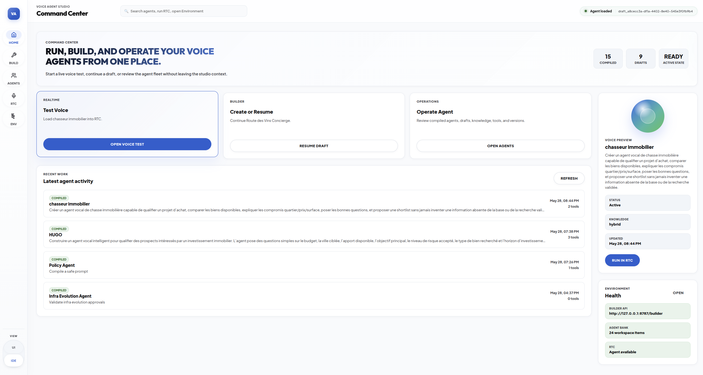

### Guided Agent Builder
A step-by-step compiler interface that walks you through defining agent identity, compiling system prompts, structuring pgvector database tables, and hooking executable tools.
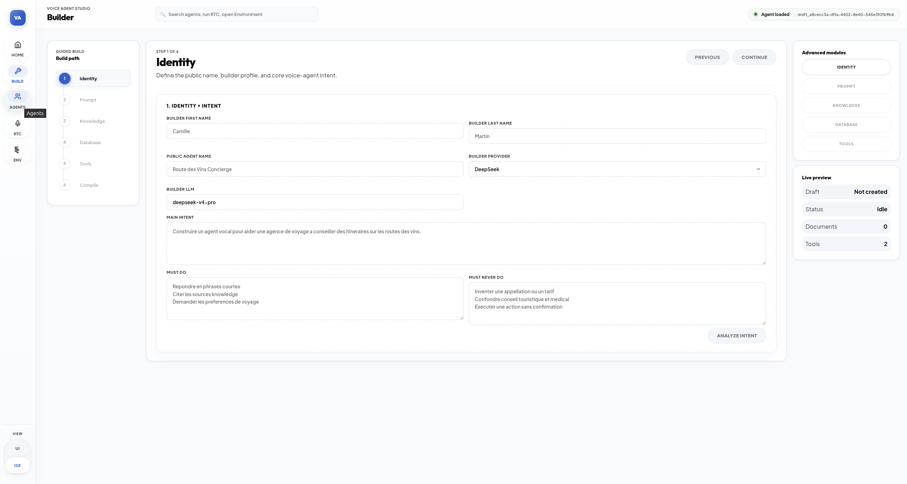

### Agent Library
Browse, search, and manage your compiled agents or active drafts. Supports one-click rollbacks to previous versions and displays detailed system logs.
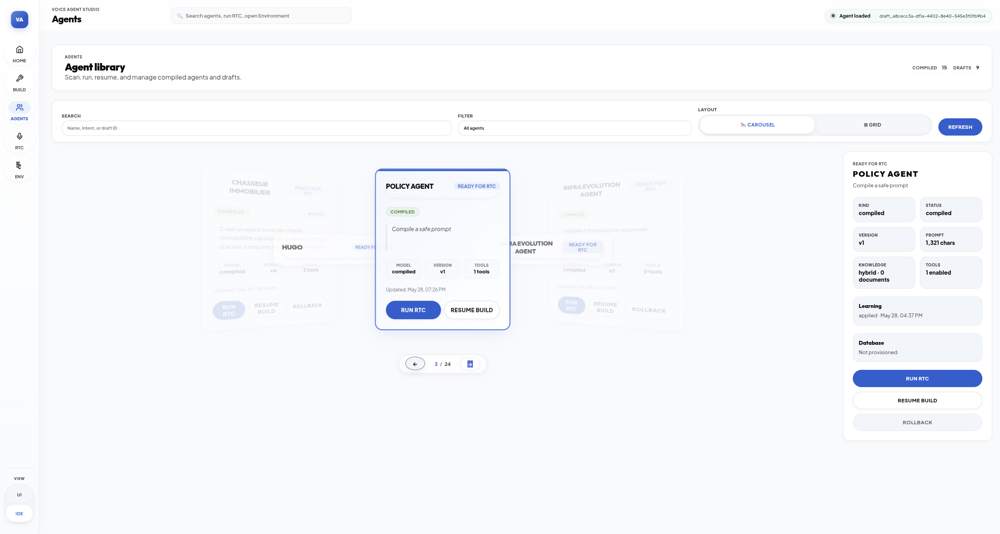

### Realtime RTC Lab
An interactive testing playground. Connect to your local voice server, check your microphone levels, and inspect duplex transcripts and tool executions in real time.
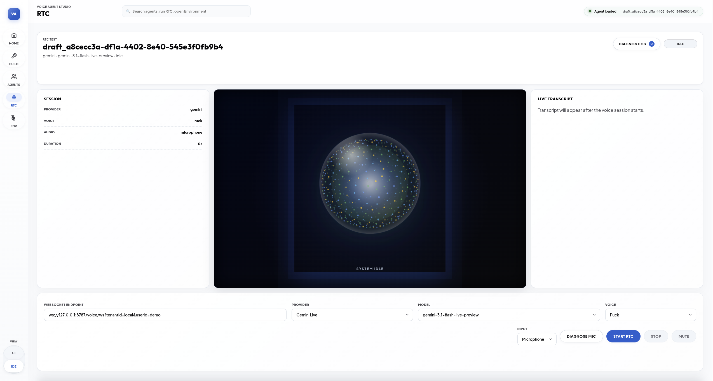

### Onboarding & Environment Health
Guided configuration tool to verify local CLI engines (Docker, Kubernetes, Terraform) and securely save LLM keys and vector credentials.
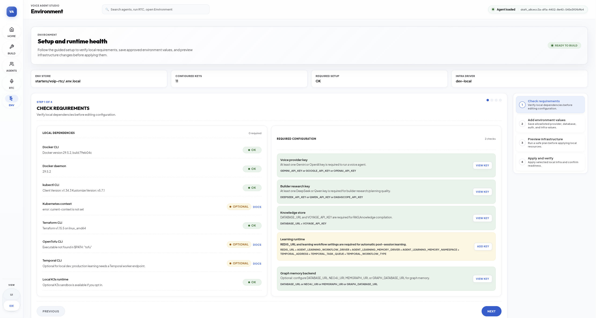

---

## Core Capabilities

*   **Declarative Agent SDK**: Define agents, prompt priority stacks, tool specifications, model providers, and vector store adapters via a typed fluent API.
*   **Low-Latency Voice Orchestrator**: A high-performance server runtime managing provider connections (WebSockets/WebRTC), raw duplex PCM16 audio streams, tool executions, and client websocket sessions.
*   **Browser Audio Client**: Lightweight client SDK that abstracts microphone capture, speaker playback queues, live volume meter calculations, and websocket connection lifecycles.
*   **Post-Session Learning Loop**: Safe, decoupled background task queue that triggers upon call completion to extract user facts, update graphs, and compile versioned drafts.
*   **Safe Repositories**: A strict data access layer that enforces tenant isolation, allowed operations, filterable fields, and paging limits before queries reach physical databases.
*   **SOLID Quality Gates**: Strict architectural validation scripts that enforce clean import boundaries, single responsibility rules, and code ceilings at compile time.

### Adaptive Agent Learning Loop

The SDK includes an embedded-first, distributed-ready learning loop for
post-session adaptation. A completed session can produce scoped memory, graph
signals, evolution proposals, prompt-safe agent versions, pending approvals,
audit records, and observable learning statuses.

Default SDK behavior is conservative: `memory_only`. Applications can opt into
`observe`, `memory_and_candidates`, `auto_apply_prompt_safe`, or
`approval_required` profiles. Production readiness still depends on
application-owned adapters for workflow durability, auth, storage, approvals,
audit, and telemetry.

---

## Architecture and Conceptual Flow

### Global Data Flow

The SDK separates frontend capture, server-side orchestration, LLM provider communication, and knowledge retrieval into clear decoupled layers:

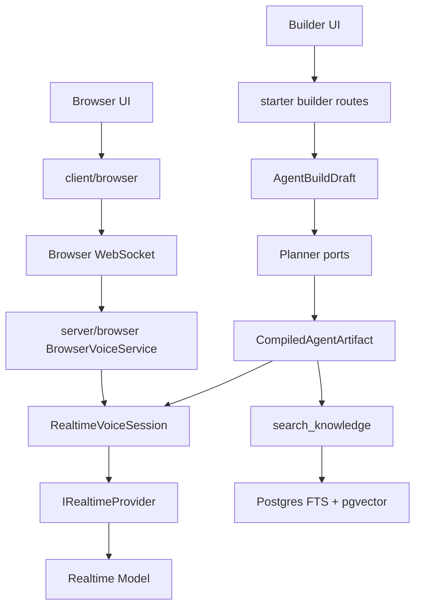

### Architectural Pillars

The SDK operates under a strict port-and-adapter architecture (Hexagonal Architecture):

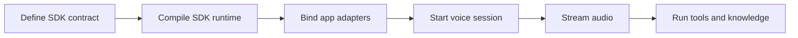

> [!NOTE]
> The core SDK defines compile-time contracts. Consuming applications bind physical adapters to abstract ports—such as authentication, secret resolvers, database drivers, and metrics telemetry—during initialization.
> Production readiness depends on downstream adapters for auth, storage, secrets, telemetry, and deployment policy.
> The VOIP RTC starter is a local/demo reference integration. It is not a multi-tenant production application unless a downstream app supplies production adapters and policies.

## What this SDK intentionally does not own

- User accounts.
- Production authentication.
- OAuth/JWT provider choice.
- Tenant databases.
- Billing.
- Compliance programs.
- Secret manager backends.
- Cloud providers.
- Production storage.

These are application-owned concerns. The SDK exposes ports and adapters so applications can plug their own implementations.

## Security Model

- Model output is untrusted.
- Uploaded documents are untrusted data.
- Tool execution requires server-side policy.
- Runtime tool argument validation covers a basic JSON Schema subset (`required`,
  primitive `type`, `enum`, numeric bounds). Complex schemas remain
  application-owned unless a downstream app adds a stricter validator around
  `ToolExecutionPolicyEngine`.
- Auth is application-owned through ports such as `AuthTicketPort`.
- Query identity is dev-only.
- Local state is dev-only for sensitive workflows.
- Server-owned prompt policy must remain the final prompt suffix.
- Learning changes must preserve prompt, tool, confirmation, and safety invariants.

## Local / Starter / Production Integration

| Capability | Local demo | Starter integration | Production app |
| --- | --- | --- | --- |
| Auth | dev token | custom `AuthTicketPort` | app-owned |
| Draft state | local file | repository port | durable DB |
| Active agent | global fallback | scoped port | explicit/scoped |
| Tool confirmation | pending action | pending action | app-owned confirmation UI/workflow |
| Learning | local async | Temporal optional | durable workflow |
| Memory | in-memory/local | Redis optional | app-owned Redis/DB |
| Graph | local/Postgres | optional graph | app-owned graph |
| Infra apply | plan/dev-local | opt-in | approval workflow |

---

## Repository Map

| Workspace Directory | Architectural Role |
| :--- | :--- |
| **`src/sdk`** | Declarative contract builders, schemas, validation compilers, and public ports. |
| **`src/server`** | Duplex audio orchestrator, model provider adapters, and session lifecycles. |
| **`src/client/browser`** | Web-native client wrapper for microphone streams, speaker queues, and websocket events. |
| **`starters/voip-rtc`** | A fully wired React + Vite + Bun template showcasing gemini-live, open-realtime, and pgvector RAG. |
| **`scripts`** | BDD test runners, static analysis checkers, and architectural quality audits. |

---

## Core Lifecycles

### 1. Agent Builder Workflow

Agents are created, planned, and compiled through a secure pipeline. Identity intent and raw documents are parsed, structured, and compiled into non-executable static schemas.

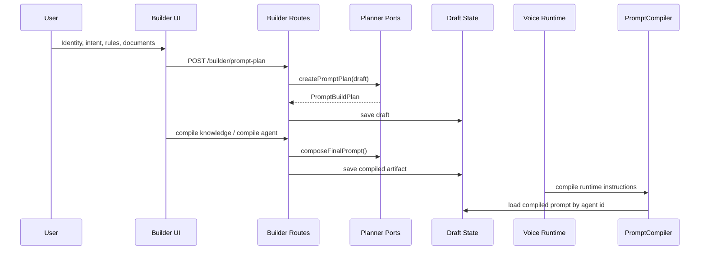

> [!TIP]
> **No Magic Prompts**: The user's ultimate goal is modeled directly as `identity.intent`. The runtime does not use fragile prompt injections or arbitrary goals; every constraint is structured.

### 2. Runtime Duplex Streaming

Duplex PCM16 audio is captured, chunked, and streamed through the server runtime. The server handles tool execution interrupts, buffers audio, and submits execution results back to the model seamlessly.

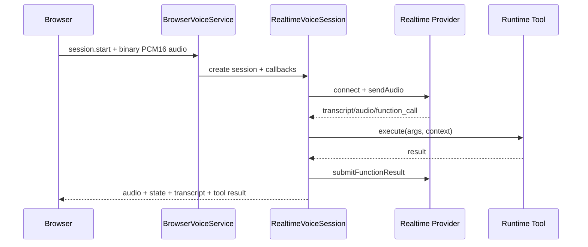

### 3. Agent Post-Session Learning Loop

To keep the voice session feeling instantaneous, RTC shutdown and background learning are completely decoupled. As soon as the call ends, a background worker consumes the transcript and updates memories or models safely.

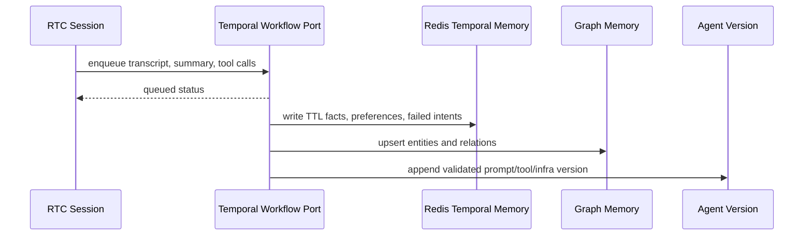

---

## Advanced Cognitive Systems

This repository contains sophisticated systems that orchestrate model training (teaching), autonomous research, vector database provisioning, and post-session long-term memory synthesis.

### 1. Adaptive LLM Harness & Multi-Agent Teaching

Building reliable agent personalities requires cross-vendor model coordination. Rather than locking prompt engineering into a single LLM vendor, the starter delegates agent creation tasks (planning, researching, and teaching) to a role-aware catalog:

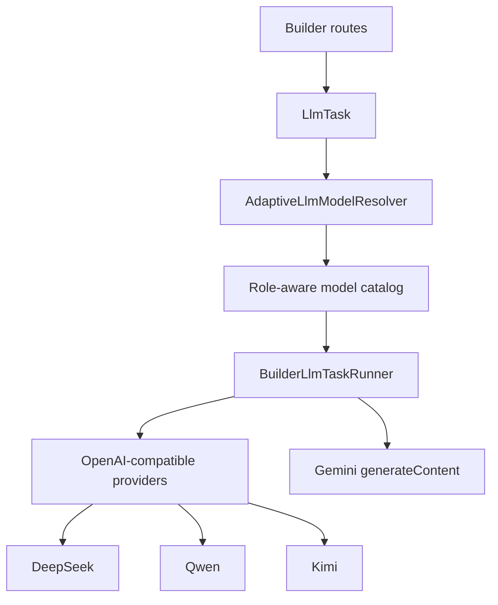

*   **Builder Planner**: Formulates prompt structures, database plans, and final system prompts using reasoning models (DeepSeek/Qwen/Gemini).
*   **Autonomous Researcher**: Synthesizes background data from untrusted documents or web queries within strict token budgets.
*   **Verifier (Teacher Pass)**: Reviews generated schemas, checks safety constraints, tests tool execution paths, and runs follow-up corrections to ensure zero prompt drift.

### 2. Multi-Tier Long-Term Memory (Temporal & Redis)

Post-session evolution occurs in the background via a structured two-tier memory architecture managed by **Temporal** workflow engines and **Redis** caches:

*   **Global Agent Memory**: Aggregates persistent facts, corrected intent models, and baseline schemas across all sessions.
*   **User-Scoped Personalization**: Keeps track of ephemeral facts, preferences, and session context. This tier leverages Redis TTL layers for instant access, falling back to Neo4j/Memgraph adapters for complex relational memory graph storage.

```
+---------------------------------------------------------------------------------+
|                         Post-Session Learning Pipeline                          |
+---------------------------------------------------------------------------------+
|  1. Capture Call       2. Trigger temporal    3. Update Redis     4. Evolve     |
|     Transcript  ---->     Workflow Engine  ->    TTL & Cypher  ->    Agent      |
|     & Metrics             (Queue Async Job)      Graph memory        Definitions|
+---------------------------------------------------------------------------------+
```

### 3. Intent-Driven RAG & Infrastructure Planning

When a user provides a raw text goal (`identity.intent`) and associated documents, the builder dynamically analyzes the computational requirements to compile a custom **Agent Infrastructure Plan** next to database indexing models:

*   **Source of Truth**: Postgres and `pgvector` store indexed documents, chunks, and handle standard semantic RAG queries.
*   **Optional Engine Provisioning**: Based on isolated environments or intent complexity, the plan provisions Neo4j/Memgraph graph connections or external Milvus vector databases.
*   **Infrastructure-as-Code (IaC)**: The engine compiles actionableIaC bundles (portable JSON configurations, OpenTofu schemas, local K3s/Kubernetes manifests) allowing automated provisioning without locking agent logic into specific cloud providers.

---

## Technical Reference and Cheat Sheets

To keep this guide concise, the comprehensive technical tables are grouped below. Click on any section to expand details.

<br>

<details>
<summary><b>Command Cheat Sheet (Audits, Tests, & Tasks)</b></summary>
<br>

### Build and Development
| Command | Target Action |
| :--- | :--- |
| `pnpm build` | Compiles the TypeScript SDK codebase into the `dist` directory. |
| `pnpm typecheck:sdk` | Typechecks the core SDK and core runtime libraries. |
| `pnpm typecheck:examples` | Reserved no-op until standalone examples are reintroduced. |
| `pnpm typecheck:starters` | Compiles the core SDK and typechecks the React/Vite VOIP starter. |
| `pnpm dev:voip-rtc` | Launches the local development starter (Bun WebSocket server + React frontend). |
| `pnpm pack:dry-run` | Audits the exported package contents prior to distribution. |

### SOLID Quality Gates & Audits
| Command | Target Action |
| :--- | :--- |
| `pnpm audit:solid` | **The Master Gate**: Executes all static cruiser rules, SRP checks, and full BDD test suites. |
| `pnpm audit:architecture` | Uses Dependency Cruiser to prevent import cycles, boundary leaks, or package coupling. |
| `pnpm audit:responsibility` | Verifies Single Responsibility Rules (max 5 exports per file, 1 component per TSX leaf). |
| `pnpm audit:secrets` | Scans workspace source files for accidentally hardcoded credentials or API keys. |
| `pnpm audit:local-secrets` | Scans local ignored `.env` config templates for rotating security parameters. |
| `pnpm audit:sdk-boundary` | Enforces structural separation between compiler interfaces and server orchestrators. |
| `pnpm audit:imports` | Verifies import paths across SDK layers. |
| `pnpm audit:tool-contracts` | Catches compiled agents using tools without verified runtime handler mappings. |
| `pnpm audit:loc` | Enforces the strict hand-written source code Line-of-Code limits. |

### Port, Adapter & Integration BDD Tests
| Command | Target Action |
| :--- | :--- |
| `pnpm test:solid-seams` | Checks critical abstraction boundaries for HTTP guards, factory engines, and validations. |
| `pnpm test:secret-hygiene:bdd` | Verifies secret audit reporting is properly masked and redacted. |
| `pnpm test:db-adapter-registry:bdd` | Confirms store contracts carry zero runtime driver opinions, mapping only to adapter keys. |
| `pnpm test:store-adapter-contracts:bdd` | Asserts physical database operations (joins, paging, soft-deletes) reside purely in adapter layers. |
| `pnpm test:runtime-db-credentials:bdd` | Ensures agents query databases via specific schemas, isolating root databases. |
| `pnpm test:secret-resolver:bdd` | Verifies API keys are securely resolved using abstract ports rather than reading `process.env`. |
| `pnpm test:tenant-resolver:bdd` | Checks scoped parameter loading (limit ceilings, provider routes, prompt context) by tenant ID. |
| `pnpm test:prompt-compiler-port:bdd` | Verifies compile-time static schemas resolve into valid instructions at runtime. |
| `pnpm test:prompt-policy:bdd` | Ensures final system prompts contain immutable validation instructions. |
| `pnpm test:learning-preserves-server-policy:bdd` | Ensures learned memory is inserted before the final server-owned policy suffix. |
| `pnpm test:model-cannot-self-confirm-tool:bdd` | Verifies model-supplied arguments cannot self-confirm write or external tools. |
| `pnpm test:pending-action-expiry-quota:bdd` | Verifies pending tool confirmations expire and enforce per-session open-action quotas. |
| `pnpm test:tool-execution-policy-engine:bdd` | Checks runtime schema validation, authorization, call limits, timeouts, audit, and redaction. |
| `pnpm test:starter-production-mode:bdd` | Verifies production starter mode refuses local-only fallbacks. |
| `pnpm test:memory-store-port:bdd` | Validates in-memory and Redis persistence behaviors inside the voice sessions. |
| `pnpm test:media-bridge-factory:bdd` | Validates PCM streaming triggers and volume meters across the browser layer. |
| `pnpm test:event-sink-logger-port:bdd` | Verifies internal session logging redacts sensitive API keys and personal data. |
| `pnpm test:fastify-voice-adapter:bdd` | Asserts Fastify and HTTP templates configure paths and WebSocket handshakes cleanly. |
| `pnpm test:tool-contracts:bdd` | Verifies executable tool definitions remain separate from serializable manifests. |
| `pnpm test:tool-registry-adapter:bdd` | Validates runtime tool execution maps to registered client/server actions. |
| `pnpm test:runtime-tool-authorization:bdd` | Asserts that agents can only execute tools explicitly allowlisted by their current schema. |
| `pnpm test:learning-active-assignment-scope:bdd` | Verifies rollback and infra approval keep active agent assignment scoped to the draft owner. |
| `pnpm test:builder-draft-ownership:bdd` | Confirms builder routes restrict draft modifications to authenticated authors only. |
| `pnpm test:builder-session-filtering:bdd` | Verifies builder session and agent-bank reads filter drafts by authenticated owner. |
| `pnpm test:document-ingestion:bdd` | Enforces file ingestion boundaries, upload types, parsing limits, and IP rate limits. |
| `pnpm test:database-provisioning` | Validates sql template generation against code injection or unauthorized permissions. |
| `pnpm test:adapter-boundaries:bdd` | Checks Milvus/graph adapter ownership boundaries and promotion requirements. |
| `pnpm test:temporal-worker:bdd` | Tests async background job handoff to Temporal queues. |
| `pnpm test:redis-memory:bdd` | Validates temporal learned data persistence across Redis TTL sessions. |
| `pnpm test:graph-memory-adapters:bdd` | Checks Bolt-compatible Cypher (Neo4j/Memgraph) graph memory adapters. |
| `pnpm test:infra-evolution-approval:bdd` | Ensures cloud or destructive network provisioning changes require manual confirmation. |
| `pnpm test:infra-runner:bdd` | Validates variables and execution scopes for OpenTofu / Infrastructure-as-Code scripts. |
| `pnpm test:learning` / `:learning:bdd` | Asserts background topic analysis, fact extraction, and agent drafting work correctly. |
| `pnpm test:knowledge-tool` | Tests pgvector search injection during conversation sessions. |
| `pnpm test:llm-harness` | Asserts builder model resolver, planner, research, and validation workflows function correctly. |
| `pnpm test:debug-audio:bdd` | Verifies local audio dump safety policies (0700/0600 folder permissions). |
| `pnpm test:runtime-tool-call` | Evaluates functional tool calling protocols. |
| `pnpm test:rtc-e2e` | Runs an end-to-end WebSocket voice communication test. |

</details>

<details>
<summary><b>Starter REST API Routes</b></summary>
<br>

### System & Telemetry Routes
*   `GET /health` : Returns runtime health metrics and total live active call count.
*   `GET /config` : Displays public voice configurations, active media channels, and supported stream formats.
*   `GET /voice/ws` : Handles browser duplex WebSocket upgrades (PCM16 protocol).

### Installation & Provisioning
*   `GET /builder/onboarding` : Evaluates local prerequisites (Docker, CLI tools) and lists redacted setup metrics.
*   `POST /builder/onboarding/env` : Persists allowlisted builder key values directly into `.env.local`.
*   `POST /builder/onboarding/infra/:action` : Controls active deployment infrastructure. Actions: `plan`, `apply`, `status`, `destroy`.

### Agent Directory
*   `GET /builder/session` : Inspects the currently active builder session state.
*   `POST /builder/session` : Deploys and compiles an existing draft agent schema into the voice runtime.
*   `GET /builder/agents` : Lists all compiled versions and pending schemas in the local repository database.
*   `GET /builder/drafts/:draftId` : Returns configuration values for a specific saved workspace draft.

### Agent Compiler Pipeline
*   `POST /builder/prompt-plan` : Starts the agent generation loop, mapping intent to structural prompt blueprints.
*   `POST /builder/prompt-clarifications` : Merges user-supplied answers back into the planning context.
*   `POST /builder/ingest-document` : Ingests, parses, and segments PDF/Word/Excel documents into raw chunks.
*   `POST /builder/run-research` : Runs budget-constrained web/knowledge research to improve definitions.
*   `POST /builder/autonomous-knowledge` : Runs research, plans indexing schemes, provisions databases, and chunks text autonomously.
*   `POST /builder/knowledge-plan` : Evaluates chunk sizes, overlap ratios, and retrieval strategies.
*   `POST /builder/database-plan` : Generates relational schemas and pgvector indexes based on user data types.
*   `POST /builder/apply-database` : Executes the generated schema on the target database schema context.
*   `POST /builder/compile-knowledge` : Generates vector embeddings and indexes chunks in the pgvector backend.
*   `POST /builder/compile-agent` : Merges instructions, hooks safe actions, generates models, and outputs a runnable compiled artifact.

</details>

<details>
<summary><b>Environment Variables (Env Cheat Sheet)</b></summary>
<br>

### 1. Realtime Streaming Providers (Gemini / OpenAI)
*   `DEFAULT_REALTIME_PROVIDER` : Target realtime provider (`gemini` or `openai`).
*   `GEMINI_API_KEY` : API Token for Google Gemini Live/Realtime.
*   `GEMINI_REALTIME_MODEL` : Gemini live model (default: `gemini-3.1-flash-live-preview`).
*   `GEMINI_REALTIME_VOICE` : Audio voice setting (e.g., `Puck`).
*   `OPENAI_API_KEY` : API Token for OpenAI Realtime.
*   `OPENAI_REALTIME_MODEL` : Realtime audio model (default: `gpt-realtime-1.5`).
*   `OPENAI_REALTIME_VOICE` : Audio voice selection (e.g., `marin`).
*   `VOICE_DEBUG_AUDIO` : Set to `local` to dump raw duplex PCM files (requires manual activation, disabled in production).
*   `VOICE_DEBUG_AUDIO_DIR` : Target directory for local audio logs (logs use `0600` permissions, directories use `0700`).

### 2. Builder LLM Harness (DeepSeek / Qwen / Kimi / Gemini)
*   `BUILDER_PROMPT_PROVIDER` : Selected compiler LLM provider (`deepseek`, `qwen`, `kimi`, `gemini`).
*   `DEEPSEEK_API_KEY` / `DEEPSEEK_MODEL` / `DEEPSEEK_BASE_URL` : Custom endpoint configurations for DeepSeek models.
*   `QWEN_API_KEY` / `QWEN_MODEL` / `QWEN_BASE_URL` : Custom endpoint configurations for Qwen models.
*   `KIMI_API_KEY` / `KIMI_MODEL` : API configurations for Kimi models.
*   `GEMINI_TEXT_MODEL` : Non-realtime model used for prompt analysis and checks (default: `gemini-3.5-flash`).

### 3. Knowledge Base & Vector Engines (Voyage / Milvus)
*   `VOYAGE_API_KEY` : Token for Voyage AI text embeddings.
*   `VOYAGE_EMBEDDING_MODEL` : Selected Voyage model (default: `voyage-4-large`).
*   `VOYAGE_EMBEDDING_DIMENSIONS` : Embedding dimensional size (default: `1024`).
*   `DATABASE_URL` : Primary Postgres instance used for schemas, vectors, and accounts.
*   `BUILDER_VECTOR_BACKEND` : Set to `milvus` to use external Milvus clusters instead of pgvector.
*   `MILVUS_URL` / `MILVUS_ADDRESS` : Milvus vector cluster address.

### 4. Background Learning & State Memory (Temporal / Redis / Neo4j)
*   `REDIS_URL` : Primary Redis cache database.
*   `AGENT_RUNTIME_MEMORY_DRIVER` : Set to `redis` to share conversation state contexts horizontally (default: `local`).
*   `AGENT_LEARNING_ENABLED` : Triggers background analytics and version updates upon call completion (default: `true`).
*   `AGENT_LEARNING_WORKFLOW_DRIVER` : Set to `temporal` to offload background learning to microservices (default: `local`).
*   `AGENT_LEARNING_MEMORY_DRIVER` : Storage system for factual memories (`local` or `redis`).
*   `TEMPORAL_ADDRESS` / `TEMPORAL_NAMESPACE` / `TEMPORAL_TASK_QUEUE` : Connection targets for Temporal workflows.
*   `NEO4J_URI` / `MEMGRAPH_URI` / `GRAPH_DATABASE_URL` : Target graph endpoints for relational memory compilation.

### 5. Infrastructure IaC & Onboarding
*   `BUILDER_INFRA_COMPUTE_TARGET` : Physical deployment type (`local`, `vm`, `k3s`, `kubernetes`, `managed`).
*   `BUILDER_INFRA_ISOLATION` : Workload separation strategy (`namespace`, `dedicated_database`, `dedicated_vm`).
*   `BUILDER_INFRA_PROVISIONING_MODE` : Deployment logic (`server_template`, `iac_plan`, `manual`, `external`).
*   `BUILDER_INFRA_APPLY_DRIVER` : Provisioning executor (`dev-local`, `external` [OpenTofu], `k3s-docker`, `kubectl`).

</details>

---

## Public Export Cheat Sheet

When integrating the SDK into custom applications, import components through dedicated entrypoints:

```ts
import { ... } from "@voiceagentsdk/core";                 // Main facade SDK export
import { ... } from "@voiceagentsdk/core/sdk";             // Builders, ports, stores, compilers
import { ... } from "@voiceagentsdk/core/server";          // Session runners, engines, memory ports
import { ... } from "@voiceagentsdk/core/server/browser";  // WebSocket server-side adapter
import { ... } from "@voiceagentsdk/core/server/providers";// Facade real-time provider transports
import { ... } from "@voiceagentsdk/core/server/media";    // Media captures & audio helper algorithms
import { ... } from "@voiceagentsdk/core/client/browser";  // Browser PCM recorder client SDK
```

Additional integration docs:

- [App-owned auth, secrets, approvals and ports](docs/sdk/app-owned-integration.md)
- [Alpha release procedure](docs/release-alpha.md)

---

## SDK Usage Example

```ts
import {
  compileVoiceAgentSdk,
  createAgentBuilder,
  createToolBuilder,
} from "@voiceagentsdk/core/sdk";

// 1. Declare a secure executable tool.
// Serialization is separated: parameter structures remain clean, while the execution
// handler is dynamically bound by the server engine.
const lookupOrder = createToolBuilder("lookup_order")
  .describe("Look up an order by id after the user provides it.")
  .parameters({
    type: "object",
    properties: { orderId: { type: "string" } },
    required: ["orderId"],
  })
  .handler(async (input, context) => {
    // Queries are checked against boundaries inside context.database
    return context.database?.query("orders", input) ?? null;
  })
  .build();

// 2. Define the Voice Agent's properties using a type-safe fluent API.
const definition = createAgentBuilder()
  .tenant({
    id: "local",
    displayName: "Local Lab",
    defaultProviderId: "gemini",
    defaultMediaBridgeId: "browser",
  })
  .provider({
    id: "gemini",
    kind: "gemini-live",
    apiKey: { name: "GEMINI_API_KEY" }, // References resolved securely at runtime
    model: "gemini-3.1-flash-live-preview",
    voice: "Puck",
  })
  .mediaBridge({
    id: "browser",
    kind: "browser-websocket",
    providerId: "gemini",
    inputEncoding: "pcm16",
    outputEncoding: "pcm16",
    sampleRate: 24000,
  })
  .prompt({
    id: "voice-system",
    channels: ["voice"],
    priority: 1,
    body: "You are concise, grounded, and confirm before external actions.",
  })
  .tool(lookupOrder)
  .build();

// 3. Compile the static configuration into a runnable, validated SDK wrapper.
const runtime = compileVoiceAgentSdk(definition);
const prompt = runtime.promptFor({ channel: "voice" });
```

---

## Safe Repository Layer

The SDK places a strict safety proxy before database adapters. In standard systems, models might be tricked into accessing other users' data. The SDK's Repository Pattern prevents this by validating scopes before executing queries.

```ts
import {
  createDbAdapterRegistry,
  createSafeRepositoryFromRegistry,
  createSqlStoreAdapterContract,
  createStoreAdapterBinding,
  createStoreBuilder,
} from "@voiceagentsdk/core/sdk";

// 1. Declare safe schemas, filtering options, and permissions.
const store = createStoreBuilder("crm")
  .adapterRef("postgres.crm") // Explicit link, carrying zero implementation leaks
  .entity("contacts", (entity) => {
    entity
      .field("name", "string")
      .field("email", "string")
      .tenantScoped("tenantId")                       // Enforces automatic tenant boundaries
      .operations(["get", "list", "create", "update"]) // Block raw deletes
      .filterable(["tenantId", "email"])
      .sortable(["email"])
      .maxPageSize(50);                                // Prevents Denial of Service via massive queries
  })
  .build();

// 2. Bind physical adapters at the app layer.
const registry = createDbAdapterRegistry({
  stores: {
    "postgres.crm": createStoreAdapterBinding(
      adapter,
      createSqlStoreAdapterContract({
        fields: [{ entity: "contacts", field: "email", target: "contacts.email" }],
        pagination: { mode: "cursor", cursorField: "id" },
      }),
    ),
  },
});

// 3. Obtain a runtime repository (automatically throws on unauthorized requests).
const contacts = createSafeRepositoryFromRegistry(store, "contacts", registry);
```

---

## SOLID and Clean Architecture Quality Gates

This repository treats design patterns as **executable compile-time constraints**. Any developer trying to bypass abstraction layers will cause automated checks to fail:

1. **Cycle & Leak Prevention (`pnpm audit:architecture`)**: Fails instantly if compiler configurations import server-side runtime code, or if browser clients attempt to reuse database schemas directly.
2. **Single Responsibility Principle (`pnpm audit:responsibility`)**: Enforces file ceilings (max 5 exports per file, 1 component per TSX leaf, pure domain packages, barrel-only rules for `index.ts` files).
3. **Boundaries (`pnpm audit:sdk-boundary` / `:imports` / `:tool-contracts`)**: Checks that runtime tool bindings remain strictly serializable manifests. Ensures `unknown.*` actions do not fall back silently.

---

## Architectural Boundary Rules & Guidelines

*   **Logic Separation**: The `src` directory contains only generic SDK core and orchestrator code. Business logic, specialized API routers, custom CSS layouts, and concrete databases belong strictly inside your downstream app, a domain pack, or starter packages.
*   **Decoupled Secret Scoping**: Code inside `src` must never inspect `process.env`. All credentials must resolve through the injectable `SecretResolverPort` at startup.
*   **Observability**: Telemetry events, live session logs, transcripts, and trace parameters must pass through the `EventSinkPort` and `LoggerPort` which enforce automated data masking.
