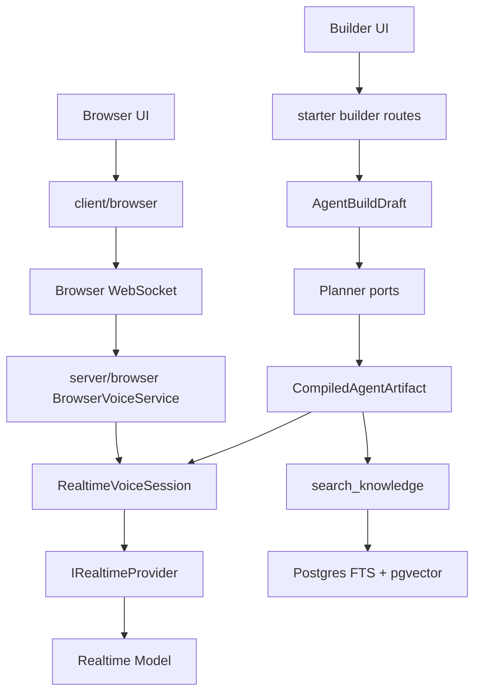
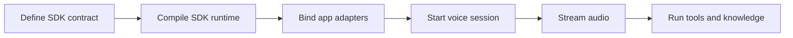
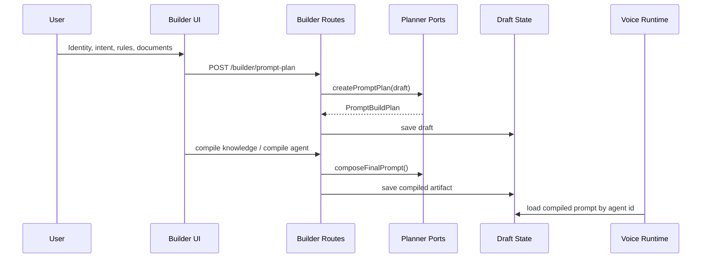
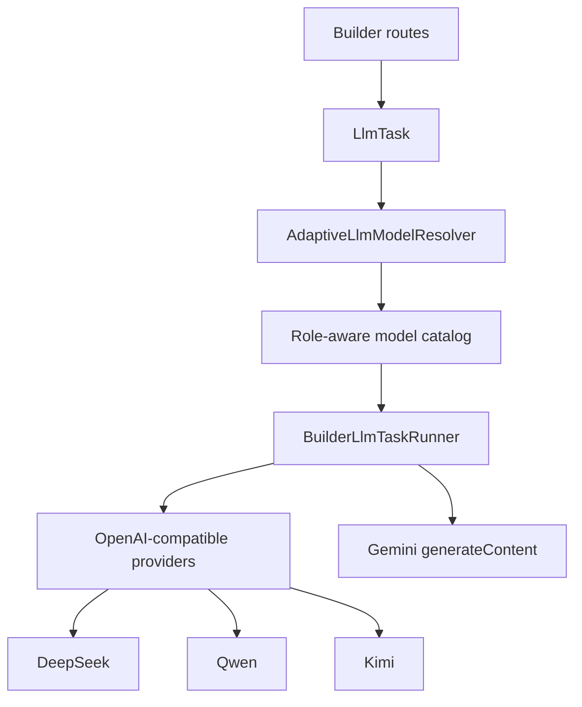
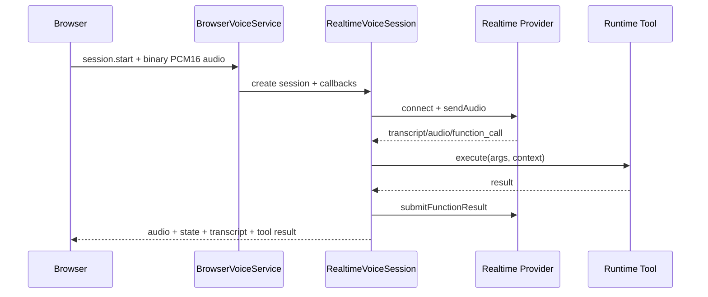

# Voice Agent SDK

Provider-pluggable SDK for building realtime conversational voice agents with
declarative prompts, tools, knowledge, safe stores, browser audio, and server
runtime orchestration.

In plain English: this repo turns "make me an AI that talks" into a structured
voice agent with a goal, tools, retrieval, providers, and guardrails, so it does
not confidently improvise its way into production.

## What You Get

- Declarative SDK for agents, prompts, tools, providers, media bridges, stores,
  databases, plans, onboarding metadata, and domain packs.
- Server runtime for realtime voice sessions, provider transports, tool calls,
  media handlers, state machines, and browser WebSocket sessions.
- Browser client for microphone capture, playback, WebSocket control messages,
  mute state, transcripts, tool call snapshots, and audio levels.
- VOIP RTC starter with Bun, React, Vite, Gemini Live, OpenAI Realtime, builder
  workflows, knowledge compilation, and Postgres/pgvector adapters.
- Safe repository layer that enforces tenant/user scope, allowed operations,
  filter fields, sort fields, writable fields, and page limits.

## Architecture



## Repository Map

| Path | Role |
| --- | --- |
| `src/sdk` | Declarative SDK types, builders, compiler, ports, store, diagnostics. |
| `src/server` | Server runtime: sessions, transports, media handlers, providers. |
| `src/client/browser` | Browser WebSocket and audio session client. |
| `starters/voip-rtc` | Reusable Bun + React/Vite starter for RTC voice projects. |
| `examples/packs/wine-investment` | Example domain pack outside core SDK. |
| `scripts` | Audits, harnesses, and runtime tool call checks. |

## Mental Model



The SDK defines contracts. Your app binds real adapters: auth, secrets,
provider keys, persistence, database, observability, and product routing.

## Builder Flow



The user-facing "goal" is represented as `identity.intent`. There is no
separate `/set goal` command in core.

## Builder LLM Harness

Builder prompts are no longer tied to one model vendor. The starter turns
planner, research, and teacher/verifier work into typed `LlmTask` requests, then
routes them through an adaptive resolver and provider adapters.



Current builder roles:

| Role | Used for | Supported starter providers |
| --- | --- | --- |
| `builder.planner` | prompt plans, knowledge plans, DB plans, final prompt composition | DeepSeek, Qwen, Kimi, Gemini |
| `builder.researcher` | budget-aware autonomous research briefs | DeepSeek, Qwen, Kimi |
| `builder.verifier` | teacher pass, coverage review, follow-up queries | DeepSeek, Qwen, Kimi, Gemini |

Provider-specific params stay behind the adapter layer: thinking toggles,
OpenAI-compatible JSON response formats, Gemini `generationConfig`, token caps,
usage normalization, retries, and tool-call normalization. Legacy direct
DeepSeek/Kimi builder adapters have been removed.

## Runtime Voice Flow



## Quick Start

```bash
pnpm install
cp starters/voip-rtc/.env.example starters/voip-rtc/.env
pnpm dev:voip-rtc
```

Open `http://127.0.0.1:5177` or `http://localhost:5177`.

The starter server runs on `http://127.0.0.1:8787` by default.

## Public Export Cheat Sheet

| Import | Use it for |
| --- | --- |
| `@voiceagentsdk/core` | Main SDK export. |
| `@voiceagentsdk/core/sdk` | Builders, SDK types, runtime compiler, stores, ports. |
| `@voiceagentsdk/core/server` | Sessions, transports, handlers, provider/runtime types. |
| `@voiceagentsdk/core/server/browser` | `BrowserVoiceService` WebSocket bridge. |
| `@voiceagentsdk/core/server/providers` | Realtime provider transport facade. |
| `@voiceagentsdk/core/server/media` | Media handlers and audio utilities. |
| `@voiceagentsdk/core/server/adapters/fastify` | Placeholder adapter contract. |
| `@voiceagentsdk/core/client/browser` | Browser voice session client. |

## SDK Builder Example

```ts
import {
  compileVoiceAgentSdk,
  createAgentBuilder,
  createToolBuilder,
} from "@voiceagentsdk/core/sdk";

const lookupOrder = createToolBuilder("lookup_order")
  .describe("Look up an order by id after the user provides it.")
  .parameters({
    type: "object",
    properties: { orderId: { type: "string" } },
    required: ["orderId"],
  })
  .handler(async (input, context) => {
    return context.database?.query("orders", input) ?? null;
  })
  .build();

const definition = createAgentBuilder()
  .tenant({
    id: "local",
    displayName: "Local Lab",
    defaultProviderId: "gemini",
    defaultMediaBridgeId: "browser",
  })
  .provider({
    id: "gemini",
    kind: "gemini-live",
    apiKey: { name: "GEMINI_API_KEY" },
    model: "gemini-3.1-flash-live-preview",
    voice: "Puck",
  })
  .mediaBridge({
    id: "browser",
    kind: "browser-websocket",
    providerId: "gemini",
    inputEncoding: "pcm16",
    outputEncoding: "pcm16",
    sampleRate: 24000,
  })
  .prompt({
    id: "voice-system",
    channels: ["voice"],
    priority: 1,
    body: "You are concise, grounded, and confirm before external actions.",
  })
  .tool(lookupOrder)
  .build();

const runtime = compileVoiceAgentSdk(definition);
const prompt = runtime.promptFor({ channel: "voice" });
```

## Builder Tool Contracts

The builder keeps tool planning separate from the final voice prompt.

- `tool-plan.system.md` and `tool-plan.user.md` describe builder-side tool
  planning.
- `final-prompt.system.md` and `final-prompt.user.md` compose only the voice
  agent system prompt.
- `ToolBuildPlan` stores serializable tool contracts: selected tools, schemas,
  permissions, side effects, confirmation policy, and runtime binding.
- `compile-agent` validates selected tools before composing the voice prompt.
- The final prompt receives voice-safe tool policy only; runtime internals such
  as `handlerRef` stay out of model-facing instructions.
- Runtime action handlers currently cover summary creation, human handoff,
  follow-up scheduling, structured notes, and knowledge search.

Use `pnpm audit:tool-contracts` to catch compiled agents that select tools
without validated runtime contracts.

## Safe Store Cheat Sheet

```ts
import {
  createSafeRepository,
  createStoreBuilder,
} from "@voiceagentsdk/core/sdk";

const store = createStoreBuilder("crm")
  .entity("contacts", (entity) => {
    entity
      .field("name", "string")
      .field("email", "string")
      .tenantScoped("tenantId")
      .operations(["get", "list", "create", "update"])
      .filterable(["tenantId", "email"])
      .sortable(["email"])
      .maxPageSize(50);
  })
  .build();

const contacts = createSafeRepository(store.entities[0], adapter);
```

The safe repository injects scope and rejects undeclared operations, filters,
sorts, writes, and oversized page requests before your database adapter runs.

## Command Cheat Sheet

| Command | Purpose |
| --- | --- |
| `pnpm build` | Compile the SDK to `dist`. |
| `pnpm typecheck:sdk` | Typecheck core SDK and runtime. |
| `pnpm typecheck:examples` | Typecheck example domain packs. |
| `pnpm typecheck:starters` | Build SDK and typecheck the VOIP RTC starter. |
| `pnpm dev:voip-rtc` | Run the reusable RTC voice starter. |
| `pnpm harness:route-wines` | Run the route-wines builder harness. |
| `pnpm test:knowledge-tool` | Check runtime knowledge tool wiring. |
| `pnpm test:runtime-tool-call` | Check runtime tool call flow. |
| `pnpm test:rtc-e2e` | Run the RTC WebSocket e2e script. |
| `pnpm audit:sdk-boundary` | Verify core SDK boundary rules. |
| `pnpm audit:imports` | Audit core import boundaries. |
| `pnpm audit:tool-contracts` | Verify compiled builder tools have runtime contracts. |
| `pnpm audit:loc` | Enforce the handwritten file LOC ceiling. |
| `pnpm pack:dry-run` | Inspect package contents. |

## Starter Routes

| Route | Purpose |
| --- | --- |
| `GET /health` | Server status and active session count. |
| `GET /config` | Public runtime provider/audio config. |
| `GET /voice/ws` | Browser voice WebSocket upgrade. |
| `GET /builder/config` | Builder providers, tools, availability, budgets. |
| `GET /builder/session` | Active compiled builder session. |
| `GET /builder/agents` | Draft/compiled agent bank. |
| `GET /builder/drafts/:draftId` | One persisted draft. |
| `POST /builder/prompt-plan` | Create prompt plan from identity and intent. |
| `POST /builder/prompt-clarifications` | Merge builder answers into prompt part 1. |
| `POST /builder/ingest-document` | Parse a document into knowledge input. |
| `POST /builder/run-research` | Run budget-aware autonomous research. |
| `POST /builder/autonomous-knowledge` | Research, plan, provision, and compile knowledge. |
| `POST /builder/knowledge-plan` | Plan RAG/KG strategy. |
| `POST /builder/database-plan` | Plan Postgres/pgvector schema. |
| `POST /builder/apply-database` | Apply validated DB plan. |
| `POST /builder/compile-knowledge` | Chunk, embed, and store knowledge. |
| `POST /builder/compile-agent` | Compose final prompt and activate artifact. |
| `POST /builder/session` | Activate an existing compiled draft. |

## Environment Cheat Sheet

Realtime providers:

```bash
DEFAULT_REALTIME_PROVIDER=gemini
GEMINI_API_KEY=
GEMINI_REALTIME_MODEL=gemini-3.1-flash-live-preview
GEMINI_REALTIME_VOICE=Puck
OPENAI_API_KEY=
OPENAI_REALTIME_MODEL=gpt-realtime-1.5
OPENAI_REALTIME_VOICE=marin
```

Builder LLMs, research, embeddings, and knowledge store:

```bash
VOICE_SERVER_HOST=127.0.0.1
VOICE_ALLOWED_ORIGINS=http://localhost:5173,http://127.0.0.1:5173
VOICE_DEV_AUTH_TOKEN=
VITE_VOICE_DEV_AUTH_TOKEN=

BUILDER_PROMPT_PROVIDER=deepseek
BUILDER_RESEARCH_PROVIDER=deepseek
BUILDER_RESEARCH_MODEL=
BUILDER_RESEARCH_ESTIMATED_COST_PER_1K_TOKENS=0.00014
BUILDER_KNOWLEDGE_VERIFICATION_PROVIDER=kimi
BUILDER_KNOWLEDGE_VERIFICATION_MODEL=
BUILDER_KNOWLEDGE_VERIFICATION_MAX_TOKENS=65536
BUILDER_KNOWLEDGE_VERIFICATION_PASSES=3

DEEPSEEK_API_KEY=
DEEPSEEK_MODEL=deepseek-v4-pro
DEEPSEEK_BASE_URL=https://api.deepseek.com
QWEN_API_KEY=
QWEN_MODEL=qwen-plus
QWEN_BASE_URL=https://dashscope-intl.aliyuncs.com/compatible-mode/v1
KIMI_API_KEY=
KIMI_MODEL=kimi-k2.6
GEMINI_API_KEY=
GEMINI_TEXT_MODEL=gemini-3.5-flash

VOYAGE_API_KEY=
VOYAGE_EMBEDDING_MODEL=voyage-4-large
VOYAGE_EMBEDDING_DIMENSIONS=1024
DATABASE_URL=postgres://...
```

## Boundary Rules

`src` is reusable SDK/runtime code. Product logic does not belong there.

Keep product-specific prompts, schemas, tools, repositories, routes, auth,
observability, and workflows in:

- a starter;
- a domain pack;
- a downstream app.

Internal generated documentation is intentionally ignored from Git through
`docs/`.

## VOIP RTC Starter

The starter in `starters/voip-rtc` is the fastest way to test the runtime:

```bash
cp starters/voip-rtc/.env.example starters/voip-rtc/.env
pnpm dev:voip-rtc
```

It launches:

- Bun WebSocket voice server;
- React/Vite RTC lab;
- builder workflow UI;
- runtime config endpoint;
- Gemini/OpenAI provider wiring;
- browser PCM16 capture/playback;
- Postgres/pgvector knowledge adapters.

## Project Status

This is an early clean-core SDK and starter. The Fastify adapter is a placeholder
until the next adapter pass wires tenant resolution, secrets, provider factories,
media bridge factories, tools, prompts, and database adapters behind public
ports. The starter builder already uses the provider-agnostic LLM harness for
planning, research, and verification.
