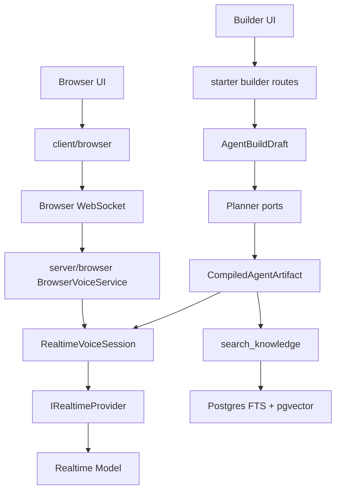
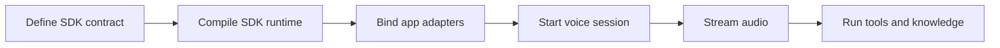
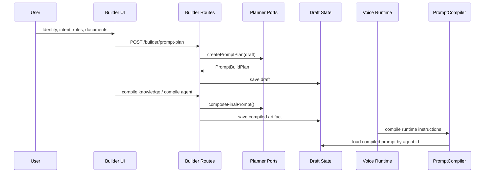
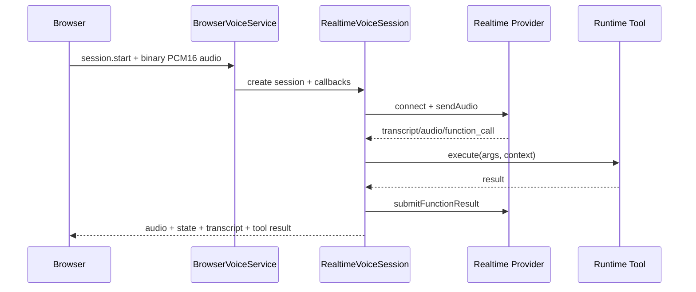
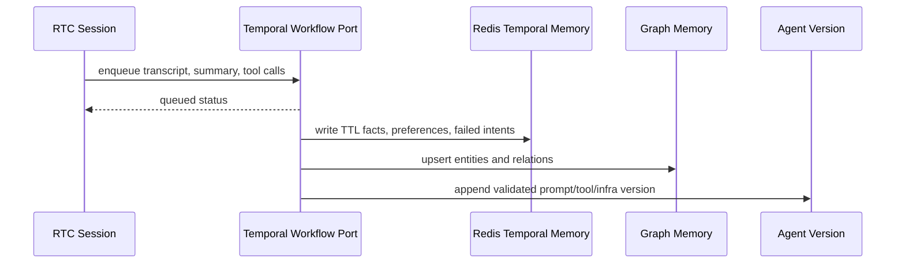

# 🎙️ Voice Agent SDK

> **Provider-pluggable SDK** for building production-ready, realtime conversational voice agents. Armed with declarative prompts, tools, knowledge bases, safe repositories, browser audio bridges, and advanced post-session learning orchestration.

In plain English: This SDK turns **"make me an AI that talks"** into a structured, production-grade voice agent. It grounds your model with custom tools, retrieval, safety guardrails, and persistent memory, preventing it from confidently hallucinating its way into production.

---

## ⚡ Quick Start (Démarrage Rapide)

Get your voice agent up and running in **under 30 seconds**:

```bash
# 1. Install dependencies
pnpm install

# 2. Setup your local environment
cp starters/voip-rtc/.env.example starters/voip-rtc/.env

# 3. Spin up the VOIP RTC local starter
pnpm dev:voip-rtc
```

🚀 **Open your browser at**: [http://127.0.0.1:5177](http://127.0.0.1:5177) (or `http://localhost:5177`)
*Note: The backend voice server runs on `http://127.0.0.1:8787` by default.*

---

## 💎 What You Get (Fonctionnalités)

*   **Declarative Agent SDK**: Define agents, prompt priorities, tools, providers, media bridges, stores, plans, and domain packs cleanly.
*   **Realtime Voice Orchestrator**: High-performance server runtime managing provider connections, live PCM16 audio streams, state machines, and active browser WebSocket sessions.
*   **Browser Audio Client**: Lightweight client for microphone capture, playback, WebSocket control events, live mute states, transcripts, and audio level meters.
*   **VOIP RTC Starter**: A full Bun + React/Vite project featuring Gemini Live, OpenAI Realtime, pgvector knowledge bases, and visual builder tools.
*   **Post-Session Learning Loop**: Queue async jobs after RTC shutdown to safely persist memories (Redis TTL / Graph), write audits, and compile optimized agent drafts.
*   **Safe Repositories**: Data safety layers enforcing tenant/user scopes, allowed operations, filter/sort rules, and strict paging limits before query execution.

---

## 🏗️ Architecture & Conceptual Flow

### Global Data Flow



### Mental Model



> [!NOTE]
> The core SDK defines contracts. Your consuming application binds real adapters via ports: authentication, secret management, persistence engines, and external observability.

---

## 🗺️ Repository Map

| Path | Role / Content |
| :--- | :--- |
| **`src/sdk`** | Declarative SDK types, builders, compiler, ports, store, diagnostics. |
| **`src/server`** | Server runtime: live sessions, transports, media handlers, providers. |
| **`src/client/browser`** | Browser WebSocket and audio session client SDK. |
| **`starters/voip-rtc`** | Reusable Bun + React/Vite starter for RTC voice projects. |
| **`scripts`** | Quality gates, local testing harnesses, and runtime tool checks. |

---

## 🔄 Core Lifecycles

### 1. Agent Builder Flow



> [!TIP]
> **No Magic Commands**: The user-facing "goal" is cleanly modeled as `identity.intent`. There is no ad-hoc `/set goal` command in the core runtime.

### 2. Runtime Voice Session Flow



### 3. Agent Post-Session Learning Loop

To keep the voice session feeling instantaneous, RTC shutdown and background learning are completely decoupled. As soon as the call ends, a background worker consumes the transcript and updates memories or models safely.



---

## 🎛️ Reference & Cheat Sheets (Expandable)

To keep this guide concise, the comprehensive technical tables are grouped below. Click on any section to expand details.

<br>

<details>
<summary><b>🛠️ Full Command Cheat Sheet (Audits, Tests, & Tasks)</b></summary>
<br>

### Build & Dev
| Command | Purpose |
| --- | --- |
| `pnpm build` | Compile the SDK to `dist`. |
| `pnpm typecheck:sdk` | Typecheck core SDK and runtime. |
| `pnpm typecheck:examples` | Reserved no-op until standalone examples are reintroduced. |
| `pnpm typecheck:starters` | Build SDK and typecheck the VOIP RTC starter. |
| `pnpm dev:voip-rtc` | Run the reusable RTC voice starter. |
| `pnpm pack:dry-run` | Inspect package contents. |

### SOLID Quality Gates & Audits
| Command | Purpose |
| --- | --- |
| `pnpm audit:solid` | **The Ultimate Gate**: Runs all architecture, responsibility, LOC, boundary, and BDD/E2E test suites together. |
| `pnpm audit:architecture` | Enforces Dependency Cruiser SOA/SOLID import boundaries (detects cycles, leaks). |
| `pnpm audit:responsibility` | Enforces SRP/LSP clean-code responsibility rules (max 5 exports per file, 1 JSX component per file, pure model/view domains, barrel-only rules for `index.ts` files). |
| `pnpm audit:secrets` | Scans committed files for leaked keys/tokens safely. |
| `pnpm audit:local-secrets` | Opt-in scan of ignored local `.env` files. |
| `pnpm audit:sdk-boundary` | Verifies core SDK boundary rules. |
| `pnpm audit:imports` | Audits core import boundaries. |
| `pnpm audit:tool-contracts` | Verifies compiled builder tools and source-level runtime binding invariants. |
| `pnpm audit:loc` | Enforces the strict handwritten file LOC ceiling. |

### Core Port & Contract BDD Tests
| Command | Purpose |
| --- | --- |
| `pnpm test:solid-seams` | Runs BDD seam tests for HTTP guards, voice factory, learning, and infra validations. |
| `pnpm test:secret-hygiene:bdd` | Checks secret audit reporting is redacted and local env scanning is explicit. |
| `pnpm test:db-adapter-registry:bdd` | Verifies stores carry adapter references and resolve correctly through the registry. |
| `pnpm test:store-adapter-contracts:bdd` | Checks SQL/document/vector store adapter mappings, pagination, and soft deletes. |
| `pnpm test:runtime-db-credentials:bdd` | Checks Postgres access resolves per-agent credential refs instead of shared DB URLs. |
| `pnpm test:secret-resolver:bdd` | Checks realtime providers, builder LLM profiles, and runtime embeddings resolve API keys through `SecretResolverPort`. |
| `pnpm test:tenant-resolver:bdd` | Checks voice media/session setup uses `TenantResolverPort` for variables and scopes. |
| `pnpm test:prompt-compiler-port:bdd` | Checks compiled prompt lookup, render fallbacks, and knowledge retrieval settings. |
| `pnpm test:prompt-policy:bdd` | Verifies compiled prompts end with immutable server-owned safety rules. |
| `pnpm test:memory-store-port:bdd` | Checks memory flows (local/Redis) resolved via `MemoryStorePort`. |
| `pnpm test:media-bridge-factory:bdd` | Checks browser voice media setup and controls. |
| `pnpm test:event-sink-logger-port:bdd` | Verifies live telemetry streams through redacting injectable ports. |
| `pnpm test:fastify-voice-adapter:bdd` | Checks that Fastify-like adapters mount health, status, and WS paths correctly. |
| `pnpm test:tool-contracts:bdd` | Verifies executable tool definitions remain separate from serializable manifests. |
| `pnpm test:tool-registry-adapter:bdd` | Verifies tool resolution flows through `ToolRegistryAdapterPort`. |
| `pnpm test:runtime-tool-authorization:bdd` | Checks that the runtime exposes *only* server-validated executable tools. |
| `pnpm test:builder-draft-ownership:bdd` | Verifies builder routes reject loading drafts belonging to different owners. |
| `pnpm test:document-ingestion:bdd` | Checks parser limits, file upload boundaries, timeouts, and IP quotas. |
| `pnpm test:database-provisioning` | Runs database provisioner checks against safe pgvector templates and malicious SQL inputs. |
| `pnpm test:adapter-boundaries:bdd` | Checks Milvus/graph adapter ownership boundaries and promotion requirements. |
| `pnpm test:temporal-worker:bdd` | Verifies post-session learning dispatches asynchronously to Temporal workers. |
| `pnpm test:redis-memory:bdd` | Checks the Redis learning memory adapter against an ephemeral container for TTL/scope. |
| `pnpm test:graph-memory-adapters:bdd` | Checks Bolt-compatible Cypher (Neo4j/Memgraph) graph memory adapters. |
| `pnpm test:infra-evolution-approval:bdd` | Verifies dangerous/destructive infrastructure changes remain pending until approved. |
| `pnpm test:infra-runner:bdd` | Checks OpenTofu/cloud-init runner scopes and execution. |
| `pnpm test:learning` / `:learning:bdd` | Verifies post-session background knowledge compilation and facts extraction. |
| `pnpm test:knowledge-tool` | Checks runtime knowledge tool injection. |
| `pnpm test:llm-harness` | Checks adaptive builder model resolver, planner, research, and validation workflows. |
| `pnpm test:debug-audio:bdd` | Verifies debug dumps are secured (0700/0600 permissions, auto-cleanup). |
| `pnpm test:runtime-tool-call` | Checks basic runtime tool invoking. |
| `pnpm test:rtc-e2e` | Runs a complete, end-to-end WebSocket voice communication test. |

</details>

<details>
<summary><b>🌐 Starter REST API Routes</b></summary>
<br>

### System & Voice
*   `GET /health` : Server status, health check, and live active session count.
*   `GET /config` : Public runtime provider and audio channel configurations.
*   `GET /voice/ws` : Upgrades incoming connection to the browser real-time PCM WebSocket bridge.

### Onboarding & Infrastructure
*   `GET /builder/onboarding` : Displays dependency environment checks and redacted setup variables.
*   `POST /builder/onboarding/env` : Safely persists allowlisted onboarding keys directly to `.env.local`.
*   `POST /builder/onboarding/infra/:action` : Controls active deployment infrastructure. Actions: `plan`, `apply`, `status`, `destroy`.

### Agent & Draft Operations
*   `GET /builder/session` : Inspects the compiled builder workflow session.
*   `POST /builder/session` : Triggers/activates an existing compiled draft by ID.
*   `GET /builder/agents` : Lists all compiled/draft versions inside the Agent Bank.
*   `GET /builder/drafts/:draftId` : Returns detailed properties of a specific persisted draft.

### Builder LLM Workflow & Planning
*   `POST /builder/prompt-plan` : Starts the loop. Composes initial Prompt Plan from identity and raw intent.
*   `POST /builder/prompt-clarifications` : Merges user-answered questions back into the planning context.
*   `POST /builder/ingest-document` : Safe upload & chunking gateway for external files.
*   `POST /builder/run-research` : Runs budget-constrained web/knowledge research to improve definitions.
*   `POST /builder/autonomous-knowledge` : Runs research, creates plans, provisions databases, and chunks knowledge autonomously.
*   `POST /builder/knowledge-plan` : Evaluates chunks, indexing settings, and RAG strategy.
*   `POST /builder/database-plan` : Designs safe Postgres database tables and pgvector definitions.
*   `POST /builder/apply-database` : Provisions the pgvector SQL template into the physical instance.
*   `POST /builder/compile-knowledge` : Generates text embeddings and inserts chunks into the active vector store.
*   `POST /builder/compile-agent` : Synthesizes the finalized voice prompt, registers safe tools, and publishes the active runnable artifact.

</details>

<details>
<summary><b>⚙️ Environment Variables (Env Cheat Sheet)</b></summary>
<br>

### 1. Realtime Streaming Providers (Gemini / OpenAI)
*   `DEFAULT_REALTIME_PROVIDER` : Choose `gemini` (default) or `openai` for live audio streaming.
*   `GEMINI_API_KEY` : API Token for Gemini Realtime/Live services.
*   `GEMINI_REALTIME_MODEL` : Live model name (default: `gemini-3.1-flash-live-preview`).
*   `GEMINI_REALTIME_VOICE` : Selected voice model name (e.g., `Puck`, `Charon`).
*   `OPENAI_API_KEY` : API Token for OpenAI Realtime services.
*   `OPENAI_REALTIME_MODEL` : OpenAI audio model name (default: `gpt-realtime-1.5`).
*   `OPENAI_REALTIME_VOICE` : Selected OpenAI voice name (e.g., `marin`).
*   `VOICE_DEBUG_AUDIO` : Set to `local` to save audio inputs/outputs for debugging (automatically disabled in production).
*   `VOICE_DEBUG_AUDIO_DIR` : Path to dump raw audio streams (e.g. `/tmp/voice-debug`). Files are saved with `0600` permissions.

### 2. Builder LLM Harness (DeepSeek / Qwen / Kimi / Gemini)
*   `BUILDER_PROMPT_PROVIDER` : Model provider used for prompt-building (`deepseek`, `qwen`, `kimi`, `gemini`).
*   `DEEPSEEK_API_KEY` / `DEEPSEEK_MODEL` / `DEEPSEEK_BASE_URL` : Token, model, and endpoint URL for DeepSeek.
*   `QWEN_API_KEY` / `QWEN_MODEL` / `QWEN_BASE_URL` : Token, model, and endpoint URL for Qwen (DashScope).
*   `KIMI_API_KEY` / `KIMI_MODEL` : Token and model name for Kimi.
*   `GEMINI_TEXT_MODEL` : Non-realtime text model used by Gemini for builder tasks (default: `gemini-3.5-flash`).

### 3. Knowledge Base & Vector Engines (Voyage / Milvus)
*   `VOYAGE_API_KEY` : API Token for Voyage AI embeddings.
*   `VOYAGE_EMBEDDING_MODEL` : Selected Voyage model (default: `voyage-4-large`).
*   `VOYAGE_EMBEDDING_DIMENSIONS` : Vector dimension size (default: `1024`).
*   `DATABASE_URL` : Root Postgres URL used for schemas, vector embeddings, and tenant storage.
*   `BUILDER_VECTOR_BACKEND` : Set to `milvus` to route RAG queries to Milvus instead of standard pgvector.
*   `MILVUS_URL` / `MILVUS_ADDRESS` : Milvus connection details.

### 4. Background Learning & State Memory (Temporal / Redis / Neo4j)
*   `REDIS_URL` : Redis address used for active caching, sessions, and Temporal post-session queues.
*   `AGENT_RUNTIME_MEMORY_DRIVER` : Set to `redis` to share runtime session contexts across containers (default: `local`).
*   `AGENT_LEARNING_ENABLED` : Enable background analysis and fact compilation on session shutdown (default: `true`).
*   `AGENT_LEARNING_WORKFLOW_DRIVER` : Set to `temporal` to offload learning workflows to microservices (default: `local`).
*   `AGENT_LEARNING_MEMORY_DRIVER` : Storage engine for compiled facts (`local` or `redis`).
*   `TEMPORAL_ADDRESS` / `TEMPORAL_NAMESPACE` / `TEMPORAL_TASK_QUEUE` : Settings for the background Temporal orchestration worker.
*   `NEO4J_URI` / `MEMGRAPH_URI` / `GRAPH_DATABASE_URL` : Target graph endpoints for structural memory extraction.

### 5. Infrastructure IaC & Onboarding
*   `BUILDER_INFRA_COMPUTE_TARGET` : Physical deployment type (`local`, `vm`, `k3s`, `kubernetes`, `managed`).
*   `BUILDER_INFRA_ISOLATION` : Workload boundary schema (`namespace`, `dedicated_database`, `dedicated_vm`).
*   `BUILDER_INFRA_PROVISIONING_MODE` : Deployment logic (`server_template`, `iac_plan`, `manual`, `external`).
*   `BUILDER_INFRA_APPLY_DRIVER` : Orchestrator script (`dev-local`, `external` [OpenTofu], `k3s-docker`, `kubectl`).

</details>

---

## 🔌 Public Export Cheat Sheet

Integrating the SDK into your own TypeScript application? Use these target entrypoints:

```ts
import { ... } from "@voiceagentsdk/core";                 // Main facade SDK export
import { ... } from "@voiceagentsdk/core/sdk";             // Builders, ports, stores, compilers
import { ... } from "@voiceagentsdk/core/server";          // Session runners, engines, memory ports
import { ... } from "@voiceagentsdk/core/server/browser";  // WebSocket server-side adapter
import { ... } from "@voiceagentsdk/core/server/providers";// Facade real-time provider transports
import { ... } from "@voiceagentsdk/core/server/media";    // Media captures & audio helper algorithms
import { ... } from "@voiceagentsdk/core/client/browser";  // Browser PCM recorder client SDK
```

---

## 💻 SDK Usage Example

```ts
import {
  compileVoiceAgentSdk,
  createAgentBuilder,
  createToolBuilder,
} from "@voiceagentsdk/core/sdk";

// 1. Create a safe executable tool definition
const lookupOrder = createToolBuilder("lookup_order")
  .describe("Look up an order by id after the user provides it.")
  .parameters({o
    type: "object",
    properties: { orderId: { type: "string" } },
    required: ["orderId"],
  })
  .handler(async (input, context) => {
    return context.database?.query("orders", input) ?? null;
  })
  .build();

// 2. Define the Agent declarative properties
const definition = createAgentBuilder()
  .tenant({
    id: "local",
    displayName: "Local Lab",
    defaultProviderId: "gemini",
    defaultMediaBridgeId: "browser",
  })
  .provider({
    id: "gemini",
    kind: "gemini-live",
    apiKey: { name: "GEMINI_API_KEY" },
    model: "gemini-3.1-flash-live-preview",
    voice: "Puck",
  })
  .mediaBridge({
    id: "browser",
    kind: "browser-websocket",
    providerId: "gemini",
    inputEncoding: "pcm16",
    outputEncoding: "pcm16",
    sampleRate: 24000,
  })
  .prompt({
    id: "voice-system",
    channels: ["voice"],
    priority: 1,
    body: "You are concise, grounded, and confirm before external actions.",
  })
  .tool(lookupOrder)
  .build();

// 3. Compile your agent and resolve instructions
const runtime = compileVoiceAgentSdk(definition);
const prompt = runtime.promptFor({ channel: "voice" });
```

---

## 🔒 Safe Repository Layer

The SDK injects strict boundaries before arbitrary DB queries are made. By specifying filters, sorts, and operations inside your declarative definition, SQL injections and unauthorized read/writes are caught instantly.

```ts
import {
  createDbAdapterRegistry,
  createSafeRepositoryFromRegistry,
  createSqlStoreAdapterContract,
  createStoreAdapterBinding,
  createStoreBuilder,
} from "@voiceagentsdk/core/sdk";

// 1. Declare safe fields and operations
const store = createStoreBuilder("crm")
  .adapterRef("postgres.crm")
  .entity("contacts", (entity) => {
    entity
      .field("name", "string")
      .field("email", "string")
      .tenantScoped("tenantId")
      .operations(["get", "list", "create", "update"])
      .filterable(["tenantId", "email"])
      .sortable(["email"])
      .maxPageSize(50);
  })
  .build();

// 2. Map physical schema adapters securely
const registry = createDbAdapterRegistry({
  stores: {
    "postgres.crm": createStoreAdapterBinding(
      adapter,
      createSqlStoreAdapterContract({
        fields: [{ entity: "contacts", field: "email", target: "contacts.email" }],
        pagination: { mode: "cursor", cursorField: "id" },
      }),
    ),
  },
});

// 3. Obtain a runtime repository (automatically throws on unauthorized requests)
const contacts = createSafeRepositoryFromRegistry(store, "contacts", registry);
```

---

## 🏗️ SOLID & Clean Architecture Quality Gates

This repository treats software design rules as **executable compile-time constraints**. Any code violating clean architecture boundary rules will cause local audits to fail:

1. **Cycle & Leak Prevention (`pnpm audit:architecture`)**: Fails instantly if SDK code imports server adapters, if UI code bypasses API gateways, or if features import sibling internal properties directly.
2. **Single Responsibility Principle (`pnpm audit:responsibility`)**: Enforces file ceilings (max 5 exports per file, 1 JSX component per file, pure model/view domains, barrel-only rules for `index.ts` files).
3. **Boundaries (`pnpm audit:sdk-boundary` / `:imports` / `:tool-contracts`)**: Checks that runtime tool bindings remain strictly serializable manifests. Ensures `unknown.*` actions do not fall back silently.

---

## 🏷️ Project Status & Context

This is an early clean-core SDK and starter. All major bridges—Tenant, Secret, Provider, Prompt, and DB resolvers—work through standard interfaces.

*   **Contribution Rule**: Keep application-specific routes, third-party authentication models, and custom database schemas out of `src/`. Place them in starter packages, domain packs, or your downstream projects.
