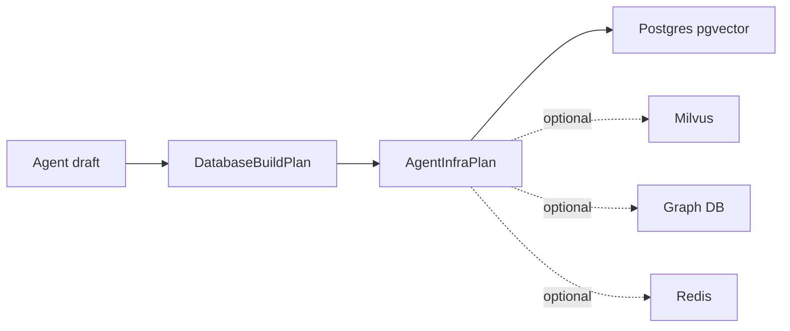
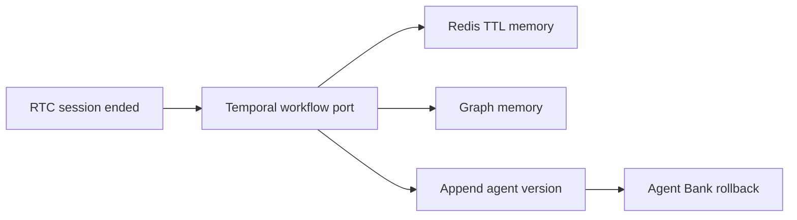

# VOIP RTC Starter

Reusable Bun + React/Vite starter for validating browser RTC voice flows around
`@voiceagentsdk/core`.

It is intentionally not a product example. It is a starter kit for future VOIP
projects:

- Bun WebSocket voice server.
- React/Vite browser RTC lab.
- Runtime provider configuration exposed through `GET /config`.
- Gemini Live and OpenAI Realtime provider wiring.
- Browser PCM16 24 kHz capture/playback through SDK worklets.
- Server-side sample-rate adaptation for provider contracts
  (Gemini 16 kHz input, browser/OpenAI 24 kHz).
- Reusable SDK bridge through `BrowserVoiceService`.
- Provider-agnostic builder LLM harness for prompt planning, autonomous
  research, and teacher verification.
- Post-session learning loop with async status, Redis TTL memory, graph memory,
  audit metadata, rollbackable agent versions, and BDD coverage.

## Flow

```mermaid
flowchart LR
  React[React RTC Lab] --> Client[BrowserVoiceSessionClient]
  Client --> WS[/voice/ws]
  WS --> Service[BrowserVoiceService]
  Service --> Session[RealtimeVoiceSession]
  Session --> Provider[Gemini Live or OpenAI Realtime]
```

## Builder Flow

```mermaid
flowchart TD
  Identity[Identity + Intent] --> PromptPlan[/builder/prompt-plan]
  PromptPlan --> LLM[Builder LLM harness]
  LLM --> Draft[AgentBuildDraft]
  Draft --> Knowledge[Knowledge + Research]
  Knowledge --> ResearchLLM[Research LLM task]
  ResearchLLM --> Teacher[Verifier LLM task]
  Knowledge --> Database[Postgres/pgvector plan]
  Database --> Compile[CompiledAgentArtifact]
  Compile --> RTC[RTC Lab session agent id]
```

The builder harness exposes model profiles by role:

Builder-controlled JSON, selected tools, and document excerpts are quoted as
untrusted data blocks before they enter LLM prompts.

| Role | Purpose | Providers |
| --- | --- | --- |
| `builder.planner` | prompt, knowledge, database, and final prompt planning | DeepSeek, Qwen, Kimi, Gemini |
| `builder.researcher` | autonomous budget-aware research briefs | DeepSeek, Qwen, Kimi |
| `builder.verifier` | teacher checks and follow-up query generation | DeepSeek, Qwen, Kimi, Gemini |

## Builder Infra Plan

Database planning now also creates `draft.infraPlan`. The onboarding script can
turn that contract into real Kubernetes resources on a local K3s cluster.



Intent routing rules are intentionally simple in this slice:

- Postgres/pgvector is always planned as `postgres-primary`.
- Milvus appears when `BUILDER_VECTOR_BACKEND=milvus`, `MILVUS_URL` is set, or
  the intent looks vector/scale heavy.
- Graph appears when the knowledge plan enables KG, graph env is present, or
  the intent talks about entities/relationships.
- Redis appears when `REDIS_URL` is set or the intent asks for cache/session
  state.
- `BUILDER_INFRA_COMPUTE_TARGET`, `BUILDER_INFRA_ISOLATION`, and
  `BUILDER_INFRA_PROVISIONING_MODE` prepare the VM/K3s/Kubernetes/IaC path.
- Database provisioning validation keeps generated SQL as planning material and
  rejects non-vector extensions, extension options, `CREATE TABLE AS SELECT`,
  arbitrary function calls, and expression indexes before server-owned
  templates apply.
- Server-owned Postgres templates set a provisioning `statement_timeout`,
  create a per-agent no-login runtime role, set its runtime timeout, and grant
  only schema `USAGE` plus table `SELECT`.

When an infra plan is valid, the starter attaches an `iac` bundle to the draft:

| Target | Generated artifacts |
| --- | --- |
| `local` | `agent-infra.plan.json`, `local/README.txt` |
| `vm` | `agent-infra.plan.json`, `vm/agent.auto.tfvars.json`, `vm/cloud-init.yaml` |
| `k3s` | namespace/config/network YAML plus `k3s/agent.auto.tfvars.json` |
| `kubernetes` | namespace/config/network YAML plus `kubernetes/agent.auto.tfvars.json` |
| `managed` | `agent-infra.plan.json`, `managed/agent.auto.tfvars.json` |

These files contain secret names, not secret values. `pnpm run infra:apply`
writes them under `.builder-state/iac`, creates or reuses a Docker-backed K3s
cluster, applies the K3s manifests with `kubectl`, and verifies the resulting
namespace, ConfigMap, and NetworkPolicy.

The browser starter opens on `Onboarding` before Builder or RTC Lab. It checks
Docker, kubectl, K3s readiness, Terraform/OpenTofu availability, writes
allowlisted runtime/auth/infra values to ignored `.env.local`, and guides
non-dev users through preview, local apply, and status checks. Destructive
cleanup is kept behind an advanced confirmation. The form also warns when the
runtime is missing at least one Gemini/OpenAI voice key, at least one
DeepSeek/Qwen builder key, or the database plus embedding keys needed for RAG.

Onboarding infra commands:

```bash
pnpm run infra:plan
pnpm run infra:apply
pnpm run infra:status
pnpm run infra:destroy
```

Useful apply env vars:

- `BUILDER_INFRA_APPLY_DRIVER=dev-local` keeps onboarding in plan-only dev mode.
- `BUILDER_INFRA_APPLY_DRIVER=k3s-docker` creates local K3s through Docker.
- `BUILDER_INFRA_APPLY_DRIVER=kubectl` applies to the active kubectl context.
- `BUILDER_INFRA_K3S_IMAGE` defaults to `rancher/k3s:v1.31.5-k3s1`.
- `BUILDER_INFRA_K3S_PORT` defaults to `16443`.

## Post-Session Learning

The starter can automatically improve an active compiled agent after an RTC
session ends. The voice session closes first; learning then continues
asynchronously and emits `learning.status` updates to the RTC Lab.



The learning plan is attached to `draft.infraPlan.storePlan` only when
`AGENT_LEARNING_ENABLED` is active. Store provisioning is delayed until the
learning workflow runs at session end, so builder planning does not eagerly
create Redis, Temporal, graph, or audit resources.

Learning writes are scoped by tenant, agent, and user. The local workflow
classifies summaries, user preferences, failed intents, missing tools, graph
entities and relations, then appends a validated agent version. Guardrails keep
versions append-only, keep a rollback pointer, audit every apply/rollback, redact
secret-looking learned memory, and forbid destructive infra migration.

Required/optional learning env:

| Env var | Purpose |
| --- | --- |
| `AGENT_LEARNING_ENABLED` | Enables post-session learning, default `true`. |
| `AGENT_LEARNING_MEMORY_TTL_SECONDS` | TTL for Redis temporal memory, default `2592000`. |
| `REDIS_URL` | Required for temporal learned memory. |
| `TEMPORAL_ADDRESS` | Required Temporal endpoint or local worker address. |
| `TEMPORAL_NAMESPACE` | Temporal namespace, default `default`. |
| `TEMPORAL_TASK_QUEUE` | Temporal task queue, default `agent-learning`. |
| `DATABASE_URL` | Required for audit/source store and default Postgres graph memory. |
| `NEO4J_URI` / `GRAPH_DATABASE_URL` | Optional external graph backend. |

BDD and regression checks:

```bash
pnpm --filter @voiceagentsdk/starter-voip-rtc test:learning
pnpm --filter @voiceagentsdk/starter-voip-rtc test:learning:bdd
pnpm --filter @voiceagentsdk/starter-voip-rtc test:rtc-e2e
```

## Run

```bash
cp .env.example .env
pnpm --filter @voiceagentsdk/starter-voip-rtc dev
```

Open `http://localhost:5177`.

The first screen is the guided onboarding flow. Use `Launchpad` after the local
checks and required settings are clear.

The server listens on `http://localhost:8787` by default and exposes:

- `GET /health`
- `GET /config`
- `GET /voice/ws`

## Route Cheat Sheet

| Route | Purpose |
| --- | --- |
| `GET /health` | Server status and active session count. |
| `GET /config` | Runtime providers, models, voices, and audio contracts. |
| `GET /voice/ws` | Browser voice WebSocket endpoint. |
| `GET /builder/config` | Builder provider/tool availability. |
| `GET /builder/onboarding` | Dependency checks plus redacted `.env.local` state. |
| `GET /builder/session` | Active compiled builder session. |
| `GET /builder/agents` | Agent bank. |
| `POST /builder/agents/rollback` | Roll back a learned agent to the previous compiled artifact. |
| `POST /builder/prompt-plan` | Create a draft from identity and intent. |
| `POST /builder/autonomous-knowledge` | Research, plan, provision, compile knowledge. |
| `POST /builder/compile-agent` | Compose final prompt and activate the agent. |
| `POST /builder/onboarding/env` | Save allowlisted onboarding keys to `.env.local`. |
| `POST /builder/onboarding/infra/:action` | Run `plan`, `apply`, `status`, or `destroy`. |

## Control Plane Auth

`/builder/*` and `/voice/ws` are protected through the SDK `AuthTicketPort`.
This starter provides a dev-token verifier using `VOICE_DEV_AUTH_TOKEN`; an
application can replace it with its own session, JWT, or one-time WebSocket
ticket verifier.

The voice runtime receives the verifier result as user context. Query params
such as `tenantId` and `userId` are only dev-mode requested identity hints, not
the trusted runtime identity source.

Builder drafts are owned by the verified builder identity at creation time.
Privileged database/knowledge workflows reload the stored draft by `draftId`,
check that owner, and ignore request-supplied draft payloads.

## Runtime Configuration

Provider setup is env-driven and UI-discoverable. Set `GEMINI_API_KEY` or
`OPENAI_API_KEY`, then the browser lab pulls available providers, models, voices,
and audio contracts from `/config`.

Useful env vars:

- `DEFAULT_REALTIME_PROVIDER=gemini`
- `GEMINI_API_KEY`
- `GEMINI_REALTIME_MODEL` defaults to `gemini-3.1-flash-live-preview`
- `GEMINI_REALTIME_VOICE`
- `OPENAI_API_KEY`
- `OPENAI_REALTIME_MODEL`
- `OPENAI_REALTIME_VOICE`

Builder and knowledge env vars:

- `VOICE_SERVER_HOST`
- `VOICE_ALLOWED_ORIGINS`
- `VOICE_DEV_AUTH_TOKEN`
- `VITE_VOICE_DEV_AUTH_TOKEN`
- `BUILDER_PROMPT_PROVIDER`
- `BUILDER_RESEARCH_PROVIDER`
- `BUILDER_RESEARCH_MODEL`
- `BUILDER_KNOWLEDGE_VERIFICATION_PROVIDER`
- `BUILDER_KNOWLEDGE_VERIFICATION_MODEL`
- `BUILDER_KNOWLEDGE_VERIFICATION_MAX_TOKENS`
- `BUILDER_DOCUMENT_PARSE_TIMEOUT_MS`
- `BUILDER_DOCUMENT_INGESTION_QUOTA_PER_IP`
- `BUILDER_DOCUMENT_INGESTION_QUOTA_WINDOW_MS`
- `DEEPSEEK_API_KEY`
- `DEEPSEEK_MODEL`
- `QWEN_API_KEY` or `DASHSCOPE_API_KEY`
- `QWEN_MODEL` or `DASHSCOPE_MODEL`
- `KIMI_API_KEY` or `MOONSHOT_API_KEY`
- `KIMI_MODEL`
- `GEMINI_API_KEY`
- `GEMINI_TEXT_MODEL`
- `VOYAGE_API_KEY`
- `VOYAGE_EMBEDDING_MODEL`
- `VOYAGE_EMBEDDING_DIMENSIONS`
- `DATABASE_URL`
- `BUILDER_INFRA_COMPUTE_TARGET`
- `BUILDER_INFRA_ISOLATION`
- `BUILDER_INFRA_PROVISIONING_MODE`
- `BUILDER_VECTOR_BACKEND`
- `MILVUS_URL` or `MILVUS_ADDRESS`
- `NEO4J_URI` or `GRAPH_DATABASE_URL`
- `AGENT_LEARNING_ENABLED`
- `AGENT_LEARNING_MEMORY_TTL_SECONDS`
- `REDIS_URL`
- `TEMPORAL_ADDRESS`
- `TEMPORAL_NAMESPACE`
- `TEMPORAL_TASK_QUEUE`

## Commands

```bash
pnpm --filter @voiceagentsdk/starter-voip-rtc dev
pnpm --filter @voiceagentsdk/starter-voip-rtc infra:apply
pnpm --filter @voiceagentsdk/starter-voip-rtc typecheck
pnpm --filter @voiceagentsdk/starter-voip-rtc harness:route-wines
pnpm --filter @voiceagentsdk/starter-voip-rtc test:knowledge-tool
pnpm --filter @voiceagentsdk/starter-voip-rtc test:infra-plan
pnpm --filter @voiceagentsdk/starter-voip-rtc test:prompt-policy:bdd
pnpm --filter @voiceagentsdk/starter-voip-rtc test:builder-draft-ownership:bdd
pnpm --filter @voiceagentsdk/starter-voip-rtc test:document-ingestion:bdd
pnpm --filter @voiceagentsdk/starter-voip-rtc test:database-provisioning
pnpm --filter @voiceagentsdk/starter-voip-rtc test:learning
pnpm --filter @voiceagentsdk/starter-voip-rtc test:learning:bdd
pnpm --filter @voiceagentsdk/starter-voip-rtc test:rtc-e2e
```

`test:document-ingestion:bdd` covers upload bounds, type allowlists, xlsx caps,
parser timeouts, and IP quotas before parsed content can feed knowledge.

`test:prompt-policy:bdd` covers the immutable server-owned policy suffix added
after generated final prompts, including tool authorization boundaries.

## Production Notes

The server binds to loopback by default, restricts browser origins, and requires
`VOICE_DEV_AUTH_TOKEN` when used in production or exposed off loopback. For real
production apps, replace the dev token with a proper identity-backed
single-use WebSocket ticket flow.
